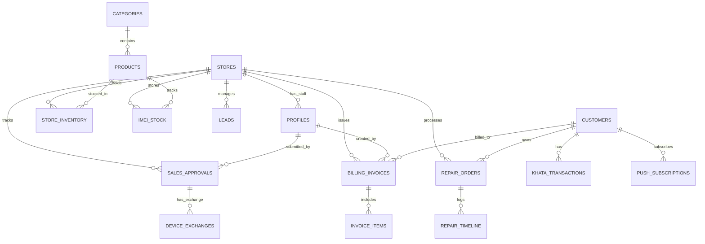

# 📱 Devi Mobile - All-in-One Mobile Store, Service & POS Management

A modern, high-performance, mobile-first web application designed for **Devi Mobile** — managing retail sales (smartphones & accessories), repair job sheets & real-time tracking, inventory/IMEI tracking, POS billing, and customer khata/ledger.

---

## 🚀 Tech Stack

- **Frontend & Fullstack Framework:** [Next.js (App Router)](https://nextjs.org/) with TypeScript
- **Styling & UI:** [Tailwind CSS](https://tailwindcss.com/), Lucide Icons, Mobile-first Responsive UI
- **Database & Backend Services:** [Supabase](https://supabase.com/) (PostgreSQL, Supabase Auth, Row-Level Security, Storage, Realtime)
- **PWA & Mobile App Wrapper:** Web App Manifest, Service Workers (`@ducanh2912/next-pwa` or Serwist) + [Capacitor / TWA](https://capacitorjs.com/) for Android APK/Play Store bundling
- **Push Notifications:** Web Push API / Firebase Cloud Messaging (FCM) / OneSignal integrated with Supabase Edge Functions & Service Workers
- **Deployment & Hosting:** [Vercel](https://vercel.com/)
- **PDF Generation & Invoicing:** `@react-pdf/renderer` or `jspdf` / `html2canvas` for bill/job-sheet receipts

---

## 🏢 Multi-Store Architecture & 3-Tier Login Roles

Devi Mobile is built with **Multi-Branch / Multi-Store** capability, offering 3 dedicated portal experiences with strict **Row-Level Security (RLS)**:

```
                      ┌─────────────────────────────────┐
                      │    👑 SUPER ADMIN (Owner / HQ)   │
                      │  - Multi-Store Global Analytics │
                      │  - Branch Management & Pricing  │
                      │  - Inter-Store Stock Transfers  │
                      └────────────────┬────────────────┘
                                       │
                ┌──────────────────────┴──────────────────────┐
                ▼                                             ▼
  ┌───────────────────────────┐                 ┌───────────────────────────┐
  │  🏪 STORE ADMIN (Branch 1)│                 │  🏪 STORE ADMIN (Branch 2)│
  │  - Branch Inventory & POS │                 │  - Branch Inventory & POS │
  │  - Manage Store Staff     │                 │  - Manage Store Staff     │
  │  - Local Khata & Repairs  │                 │  - Local Khata & Repairs  │
  └─────────────┬─────────────┘                 └─────────────┬─────────────┘
                │                                             │
                ▼                                             ▼
  ┌───────────────────────────┐                 ┌───────────────────────────┐
  │  🧑‍💼 SALESMAN / STAFF     │                 │  🧑‍💼 SALESMAN / STAFF     │
  │  - Fast POS Billing       │                 │  - Fast POS Billing       │
  │  - Repair Job-Sheets      │                 │  - Repair Job-Sheets      │
  │  - IMEI Scanning          │                 │  - IMEI Scanning          │
  └───────────────────────────┘                 └───────────────────────────┘
```

### 1. 👑 Super Admin (HQ / Business Owner)
- **Multi-Branch Switcher:** Switch between all branches or view consolidated HQ reports.
- **Store & Branch Management:** Add new stores/branches, set location, GST details, contact numbers.
- **Store Admin Allocation:** Create and assign Store Admins to specific branches.
- **Consolidated Analytics:** Total revenue, gross profit margins, branch comparison, highest-performing salesmen.
- **Inter-Store Stock Transfers:** Initiate or approve device transfers between branches.

### 2. 🏪 Store Admin (Branch Manager)
- **Branch Level Operations:** Full control over their assigned store's daily business.
- **Staff Management:** Add and manage Salesmen and Technicians for their specific store.
- **Store Inventory & Stock Alerts:** Manage local phone units (IMEI) and accessories stock.
- **Local Customer Khata & POS:** Oversee all branch billing, payments, and repair job-sheets.
- **Daily Closing Reports:** Cash-in-hand, UPI totals, and end-of-day balance reconciliations.

### 3. 🧑‍💼 Salesman / Staff / Technician
- **Fast POS Billing:** Barcode/IMEI scan, add items to cart, print/share digital bills.
- **Repair Service Desk:** Create repair tokens/job-sheets, update repair timeline stages (`In Progress`, `Ready`).
- **Customer Lookup:** Search customer by phone number to check warranty or pending khata balance.
- **Secure Access:** Restricted from viewing sensitive store profit margins, vendor purchase prices, or HQ settings.

---

## 🧑‍💼 Detailed Salesman Flow & POS Logic (Analyzed from Devi Flutter Codebase)

The salesman module follows a battle-tested, fraud-proof workflow with real-time validation and a **2-Step Approval Pipeline**:

```
 ┌─────────────────┐     ┌─────────────────────┐     ┌─────────────────────┐
 │ 1. Select Cat.  │ ──► │ 2. Scan IMEI / Code │ ──► │ 3. Customer Info    │
 │ (Phone/Acc/App) │     │ (Auto-fill Details) │     │ (Name, Phone, Addr) │
 └─────────────────┘     └─────────────────────┘     └──────────┬──────────┘
                                                                │
 ┌─────────────────┐     ┌─────────────────────┐                │
 │ 6. Review &     │ ◄── │ 5. Exchange & Gifts │ ◄──────────────┘
 │ Mathematical Val│     │ (Old Phone, Gifts)  │
 └────────┬────────┘     └─────────────────────┘
          │
          ▼
 ┌────────────────────────────────────────┐
 │ 7. Submit to `sales_approvals`         │
 │ (Status: 'pending_approval')           │
 └──────────────────┬─────────────────────┘
                    │
                    ▼
 ┌────────────────────────────────────────────────────────────────────────┐
 │ 🏪 Store Admin / 👑 Super Admin Reviews Sale                           │
 │                                                                        │
 │ ├─► 🟢 APPROVED: Stock Deducted + GST Invoice Generated + Ledgers Updated│
 │ └─► 🔴 REJECTED: Returned to Salesman with Rejection Reason             │
 └────────────────────────────────────────────────────────────────────────┘
```

### 1. Category Selection
Salesman chooses one of 3 retail categories:
- 📱 **Mobile Phone** (Defaults payment method to EMI/Finance)
- 🎧 **Accessories** (Defaults payment method to Cash)
- 📺 **Appliances** (Defaults payment method to EMI/Finance)
*(Note: Spare Parts is restricted exclusively to Technician/Manager dashboards).*

### 2. Live IMEI / Barcode Scanning & Auto-Fill
- Salesman scans barcode/IMEI via mobile camera or types serial number.
- System queries store inventory in real-time.
- **Auto-Fills:** Product Name, HSN Code, Sub Category, and Selling Price.
- **Final Price Calculation:** $\text{Final Price} = \text{Product Price} - \text{Discount}$.

### 3. Split-Payment Engine & Strict Real-Time Formulas
The submission button is mathematically locked until the total payment equals the final price.

#### 💵 Cash Payment Mode:
$$\text{Cash Amount} + \text{UPI Amount} + \text{Card Amount} + \text{Device Exchange Value} = \text{Final Price}$$

#### 🏦 Finance / EMI Payment Mode:
$$\text{Down Payment (Cash + UPI + Card)} + \text{Device Exchange Value} + \text{Disbursement Amount} = \text{Final Price}$$
- **Supported Finance Providers:** Bajaj Finserv, HDFC Bank, ICICI Bank, Pine Labs.
- **Live Validation Feedback:** Displays real-time status:
  - 🟢 *"Payment validation successful!"*
  - 🔴 *"Payment short by ₹X"*
  - 🔴 *"Payment excess by ₹X"*

### 4. Device Exchange (Old Phone Trade-In) & Gifts
- **Old Phone Exchange:** Captures Old Device IMEI, Name, Physical Condition (*Excellent, Good, Fair, Poor*), and Exchange Value (which offsets the customer's payable total).
- **Complimentary Gifts:** Tag promotional items (Back cover, Neckband, Charger, Tempered glass).
- **EMI Lock Flag:** Track whether the device has Knox / Finance EMI lock enabled (`isEmiLocked: true/false`).

### 5. 2-Step Approval Pipeline (`sales_approvals`)
- Salesman submits the sale ➔ Saved in `sales_approvals` collection/table with status `pending_approval`.
- Salesman dashboard tracks real-time status:
  - 🟡 **Pending Approval:** Awaiting Store Admin / Manager review.
  - 🟢 **Approved / Completed:** Inventory deducted, printable 18% GST Invoice (9% CGST + 9% SGST) generated.
  - 🔴 **Rejected:** Shows manager's feedback / rejection reason.

### 6. Leads CRM & Follow-Up System
- Salesman can log walk-in prospective buyers and track them across stages:
  - `New` ➔ `Contacted` ➔ `Interested` ➔ `Follow Up` ➔ `Converted` (or `Not Interested`).
  - Target Interests: Smartphones, Accessories, Home Appliances.

---

## 📑 Financial Register & Daily Cash Book (`register_screen.dart` Architecture)

The **Register Screen** is the central financial audit and daily closing engine for Devi Mobile. It provides a real-time, tamper-evident record of all transactions approved by the store manager.

### 1. Date Filtering
- **Presets:** `Today`, `Yesterday`.
- **Custom Range:** Single Date Picker or Custom Date Range (`Start Date` to `End Date`).
- Partitioned database queries to ensure lightning-fast fetching without downloading entire historical tables.

### 2. 6 Core Summary KPI Cards
| KPI Card | Formula / Source | Description |
| :--- | :--- | :--- |
| **Total Records** | $\text{Count of Approved Sales}$ | Total transactions completed in period |
| **Total Sales** | $\sum \text{Final Amount}$ | Total net retail sales value |
| **Cash** | $\sum (\text{Cash Amount} + \text{Down Payment Cash})$ | Physical cash collected in the drawer |
| **UPI** | $\sum (\text{UPI Amount} + \text{Down Payment UPI})$ | Digital bank payments via QR/UPI |
| **Card** | $\sum (\text{Card Amount} + \text{Down Payment Card})$ | POS Card swipe terminal receipts |
| **Finance** | $\sum \text{Disbursement Amount}$ | Pending/approved loans to be settled by Banks |

### 3. Itemized 19-Column Audit Table
Every single approved transaction is broken down into an Excel-style interactive data grid:
1. `Sr.` - Serial Index
2. `Customer Name` - Buyer name
3. `Phone Number` - Contact info
4. `Product Name` - Device/Item purchased
5. `Category` - Mobile Phone / Accessories / Appliances
6. `IMEI / Serial` - Device unique identifier
7. `Total MRP` - Original product base price
8. `Discount` - Concession given
9. `Final Amount` - Net payable amount
10. `Payment Type` - Cash / UPI / Card / Finance (Provider Name)
11. `Cash` - Cash portion (including down payment)
12. `UPI` - UPI portion (including down payment)
13. `Card` - Card portion (including down payment)
14. `Disbursement` - Bank loan amount disbursed
15. `Device Exchange` - Traded-in old phone value
16. `VAS Details` - Value Added Services (Extended Warranty, Insurance)
17. `Gift Items` - Free gifts provided with sale
18. `Salesman` - Sales representative who booked the sale
19. `Approved By` - Manager/Admin who verified and approved the transaction

### 4. Register PDF Export & Print Service (`RegisterPrintService`)
- Multi-page A4 Landscape report with Devi Mobile letterhead, branch details, date range, summary cards, and itemized transaction tables.
- Optimized pagination for CA/Accountant monthly audits and daily store cash-register tallying.

---

## 🎯 Key Features & Modules

### 1. 🛍️ Customer Storefront & Digital Catalog
- **Store-Wise Catalog & Stock Availability:** Customers can select nearest Devi Mobile branch to view available stock.
- **Product Showcase:** New smartphones, second-hand/refurbished phones, accessories, spare parts.
- **Smart Filtering & Search:** Filter by Brand, Price Range, RAM/Storage, Condition (New/Refurbished), Warranty.
- **Direct WhatsApp Inquiry / Order:** Quick 1-tap WhatsApp checkout and order booking with pre-filled product details.
- **Mobile-First Experience:** Blazing-fast responsive layout optimized for smartphone screens.

### 2. 🔧 Repair & Service Job-Sheet Management
- **Branch-Wise Repair Booking:** Book screen replacement, battery health fixes, motherboard diagnostics, water damage, etc.
- **Unique Job-Sheet / Token Tracking:** Customers track repair status in real-time (`Received` ➔ `Diagnosing` ➔ `Waiting for Parts` ➔ `Repaired / Testing` ➔ `Ready for Pickup` ➔ `Delivered`).
- **Technician Notes & Photo Uploads:** Upload device condition photos at check-in (stored in Supabase Storage).
- **Cost Estimation & Approval:** Digital cost estimate with customer SMS/WhatsApp approval.

### 3. 📦 Inventory & Multi-Store IMEI Tracking
- **IMEI & Serial Tracking:** Unique IMEI tracking for every smartphone unit (in-stock at Branch X, sold, transferred, defective).
- **Inter-Store Stock Transfers:** Transfer devices from Store A to Store B with status tracking (`Dispatched` ➔ `Received`).
- **Accessories & Spares Stock:** Real-time stock counts with low-stock alerts per store.
- **Supplier & Purchase Order Logs:** Track vendor purchase costs and stock additions.

### 4. 🧾 POS Billing, Invoicing & Khata (Ledger)
- **Fast Bill Mode:** 1-Click quick billing for accessories & walk-in counter items.
- **Regular GST / Non-GST Invoices:** 18% GST calculation (9% CGST + 9% SGST), HSN codes, printable and downloadable PDF receipts with branch-specific address & GSTIN.
- **Customer Khata (Credit/Udhar Ledger):** Track customer payment balance, partial payments, and payment reminder notifications.

### 5. 📊 Multi-Tier Admin & Analytics Dashboard
- **Role-Based Access Control (RBAC):** Super Admin vs. Store Admin vs. Salesman.
- **Business Insights:** Store-wise sales, repairs completed, pending pickups, daily revenue, profit estimates.
- **Customer Directory:** History of purchases, repairs, and warranty records across branches.

### 6. 📲 PWA, Push Notifications & Android Wrapper
- **Progressive Web App (PWA):** Installable on Android/iOS home screen with native app feel and offline fallback.
- **Push Notifications:** Instant background notifications when repair status changes (*"Aapka device pick-up ke liye ready hai!"*), sale approvals, or invoice delivery.
- **Android App Wrapper:** Ready-to-publish Android APK / Google Play Store bundle using Capacitor / TWA (Trusted Web Activity).

---

## 🗄️ Database Architecture (Supabase PostgreSQL)



### Core Tables Outline:
1. `stores`: Store ID, Branch Name, Branch Code (`DM-01`), Address, Phone, GSTIN, Is Active.
2. `profiles`: User ID (Supabase Auth), Full Name, Role (`super_admin`, `store_admin`, `salesman`), Store ID (nullable for super_admin), Active Status.
3. `customers`: Customer ID, Name, Phone, Email, Address, Primary Store ID, Total Credit/Khata Balance.
4. `categories`: Mobile Phones, Accessories, Appliances, Spare Parts.
5. `products`: Product ID, Title, Description, Category ID, Brand, Model, Base Price, Min Selling Price, HSN Code, Barcode, Images.
6. `store_inventory`: Store ID, Product ID, Quantity, Low Stock Alert Level.
7. `imei_stock`: IMEI 1, IMEI 2, Product ID, Store ID, Color, Storage, Purchase Cost, Selling Price, Status (`in_stock`, `sold`, `in_transfer`, `defective`).
8. `stock_transfers`: Transfer ID, From Store ID, To Store ID, Product ID, IMEI, Status (`pending`, `in_transit`, `received`, `rejected`), Created By, Received By.
9. `sales_approvals`: Approval ID, Store ID, Sales Person ID, Customer Info (Name, Phone, Address), Product Info (ID, IMEI, Price, Discount, Final Price), Payment Info (Cash, UPI, Card, Down Payment, Disbursement, Finance Provider), Exchange ID, Gifts, Status (`pending_approval`, `approved`, `rejected`), Rejection Reason, Approved By, Approved At.
10. `device_exchanges`: Exchange ID, Sale Approval ID, Store ID, Device IMEI, Device Name, Condition (`Excellent`, `Good`, `Fair`, `Poor`), Valuation Amount, Status (`in_stock`, `refurbished`, `sold`).
11. `leads`: Lead ID, Store ID, Sales Person ID, Customer Name, Phone, Interest Category, Status (`New`, `Contacted`, `Interested`, `Follow_Up`, `Converted`, `Not_Interested`), Notes, Follow Up Date.
12. `repair_orders`: Token/Job-Sheet ID, Store ID, Customer ID, Device Model, Issue Description, Condition, Photos, Est. Cost, Final Cost, Status, Assigned Technician.
13. `repair_timeline`: Repair ID, Status, Remarks, Updated By (Profile ID), Timestamp.
14. `billing_invoices`: Invoice ID, Store ID, Invoice Number (`DM1-2024-001`), Customer ID, Subtotal, Discount, Tax (GST 18%), Base Amount, CGST (9%), SGST (9%), Total, Payment Mode, Created By (Salesman ID).
15. `invoice_items`: Invoice ID, Product ID, IMEI, Quantity, Unit Price, Tax Rate, Total.
16. `khata_transactions`: Transaction ID, Store ID, Customer ID, Type (Debit/Credit), Amount, Balance After, Note, Created By.
17. `push_subscriptions`: Customer/User ID, Endpoint, P256DH key, Auth key, FCM token, Device Platform (Android/Web), Active Status.

---

## 🗓️ Phase-wise Development Plan

### 📍 Phase 1: Project Setup & Multi-Store Foundation
- [ ] Initialize Next.js (App Router) with TypeScript, Tailwind CSS, and Lucide Icons.
- [ ] Configure Supabase client & environment variables (`.env.local`).
- [ ] Setup Base Layout with Mobile-First Navigation (Store Switcher for Super Admin, Sidebar & Bottom Navigation).
- [ ] Create Supabase SQL migration script (All 14 tables, Enum types, Row Level Security policies for 3 roles).

### 📍 Phase 2: Authentication & 3-Tier Role-Based Dashboard
- [ ] Supabase Auth setup with Email/Password & Phone OTP login.
- [ ] Role-Based Route Protection & Middleware (Super Admin ➔ `/admin/super`, Store Admin ➔ `/admin/store`, Salesman ➔ `/pos`).
- [ ] Branch/Store Management UI for Super Admin.
- [ ] Staff Invitation & Role Assignment UI.

### 📍 Phase 3: Public Storefront & Digital Catalog
- [ ] Responsive Home Page: Hero banner, Multi-store branch selector, Featured phones, Trending accessories, Quick repair booking CTA.
- [ ] Product Catalog Page: Category filter, Brand filter, Price slider, In-stock branch locator, Search bar.
- [ ] Product Details Page: Image gallery, Specifications table, Variant selector, "Order via WhatsApp" button.
- [ ] Contact Us & Multi-Branch Store Locator.

### 📍 Phase 4: Mobile Repair & Live Tracking System
- [ ] Public Repair Tracking Page: Search by Token / Mobile Number to see animated live status timeline.
- [ ] Customer Repair Booking Form: Select branch, device model, issue type, date preference.
- [ ] Branch Job-Sheet Creation: Create new repair ticket, generate printable/downloadable Job Sheet slip with QR code.
- [ ] Technician Update Panel: Update repair stages, add remarks, upload before/after photos.

### 📍 Phase 5: POS Billing, Multi-Store Inventory & Khata
- [ ] Store Inventory & IMEI Stock Management: Add/Edit products, bulk IMEI entry, low-stock indicators, inter-store transfer module.
- [ ] Fast POS Billing Screen: Barcode/IMEI scan, customer lookup, discount & tax calculation, multiple payment modes.
- [ ] Digital Invoice Generation: Clean PDF bill with branch details, GST, terms & QR code for UPI payments.
- [ ] Customer Khata / Udhar Tracker: View branch customer balance, record partial payments.

### 📍 Phase 6: Super Admin & Store Admin Analytics
- [ ] Super Admin Dashboard: Consolidated sales, top branches, top staff performers, overall profit & stock valuation.
- [ ] Store Admin Dashboard: Daily store sales, repair turnaround time, daily cash register closing report.

### 📍 Phase 7: PWA, Push Notifications & Android Wrapper
- [ ] PWA Configuration: `manifest.webmanifest`, App icons, Service Worker setup.
- [ ] Push Notification Engine: Web Push / FCM integration with Supabase triggers on repair status change.
- [ ] In-app "Install App" banner prompt for customers & staff.
- [ ] Capacitor / Android wrapper configuration for native APK build & Google Play Store readiness.

### 📍 Phase 8: Testing, Optimization & Deployment
- [ ] Mobile responsiveness testing across multiple viewports (Mobile, Tablet, Desktop).
- [ ] Performance optimization (Next.js Image optimization, Supabase query caching).
- [ ] Vercel Deployment setup & custom domain configuration.
- [ ] Android APK Build generation & testing.
- [ ] User testing & handover.

---

## 🛠️ Environment Variables Setup

Create a `.env.local` file in the root directory:

```env
# Supabase Configuration
NEXT_PUBLIC_SUPABASE_URL=https://your-project.supabase.co
NEXT_PUBLIC_SUPABASE_ANON_KEY=your-anon-key
SUPABASE_SERVICE_ROLE_KEY=your-service-role-key

# Shop / Business Configuration
NEXT_PUBLIC_STORE_NAME="Devi Mobile"
NEXT_PUBLIC_STORE_PHONE="+91XXXXXXXXXX"
NEXT_PUBLIC_STORE_WHATSAPP="91XXXXXXXXXX"
NEXT_PUBLIC_STORE_ADDRESS="Your Store Address, City, State"
```

---

## 🚀 Getting Started

### 1. Install Dependencies
```bash
npm install
```

### 2. Run the Development Server
```bash
npm run dev
```

Open [http://localhost:3000](http://localhost:3000) in your browser to see the result.

---

## 🚢 Deployment on Vercel

1. Push your code to a GitHub repository.
2. Import the repository into [Vercel](https://vercel.com).
3. Add the environment variables (`NEXT_PUBLIC_SUPABASE_URL`, `NEXT_PUBLIC_SUPABASE_ANON_KEY`, etc.) in the Vercel Dashboard.
4. Click **Deploy**! 🚀
